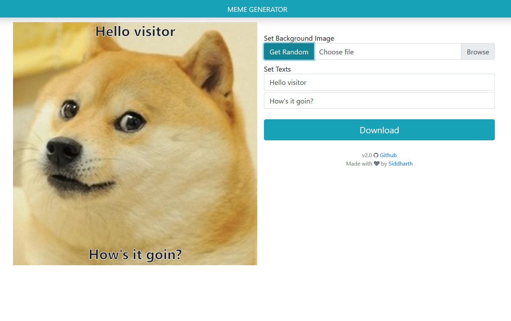

## meme-generator-web-app

### _A fun simple javascript Web-app project to generate meme and download._

#### Features:

- Get Random meme as background.
- Ability to use custom images as background.
- Hassle free download.

#### Screenshots

#### APIS and Dependencies used:

- [Dom To Image](https://github.com/tsayen/dom-to-image)
- [File Saver JS](https://github.com/eligrey/FileSaver.js/)
- [JQuery](https://jquery.com/)
- [ImageFlip API (for random memes)](https://api.imgflip.com/)
- [BootStrap for Style](https://getbootstrap.com/)
- [FontAwesome For Icons](https://fontawesome.com/)
